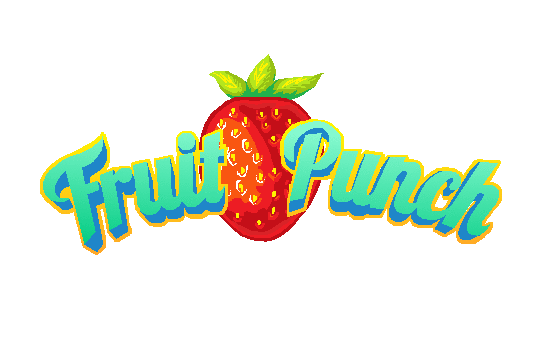

<p align="center">
  
</p>

## Overview

**_Fruit Punch_** is an interactive web app game that tracks a user's motions through their built-in webcam. Punch the fruit that spawn randomly on screen! Clicking START will bring you to the Game Selection page:

1.  **Normal Mode**
    * Familarize yourself with the game! See how fast it takes you to squish 50 fruits!
2.  **Beat The Clock**
    * Now you're on the clock! See how many fruits you can destroy in just a minute!
3.  **Sudden Death**
    * Squish as many fruit as you can _without hitting a bomb!_ But be careful, after every round a new bomb is added to your game play!

## Getting Started

Clone this repo into a local directory then `cd` into that project folder

Use _PostgreSQL_ [[link](https://www.postgresql.org/)] to create a database called `fruitpunch` for leaderboard funcitonality

```bash
npm install        // require necessary packages
npm start          // runs on localhost:1337
npm run start-dev  // runs with webpack
```

## Authors

* [Samantha Ashley](https://github.com/smashley729)
* [Kirsten Lindsmith](https://github.com/kirstenlindsmith)
* [Cassie Rosner](https://github.com/cerosner)

## Acknowledgments

* The Grace Hopper/Fullstack Academy community
* PoseNet via Tensorflow.js [[link](https://github.com/tensorflow/tfjs-models/tree/master/posenet)]
* Previous GH/FS Capstone projects for inspo:
  * Dance Dance Pose [[link](https://github.com/dancing-karaoke/Dance-Dance-Pose)]
  * AirBrush [[link](https://github.com/bananalark/airbrush)]
* Our awesome friends and family 💖💫

## License

This project is licensed under the MIT License.
